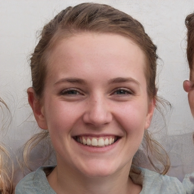
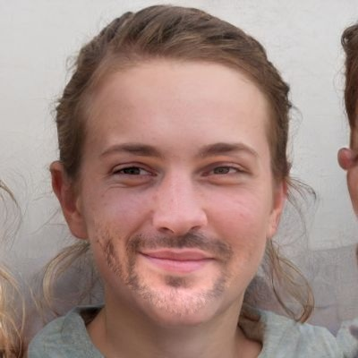

# Face Swap Application

[Website](https://andy6804tw.github.io/faceswapper/)

## Results
| Source | Destination | Result |
| --- | --- | --- |
| |  |  |
| |  |  |
| |  |  |

## Image Credits
All pictures are from [This Person Does Not Exist](https://thispersondoesnotexist.com/).

## Reference
[Fast Face-swap Using Convolutional Neural Networks](https://arxiv.org/pdf/1611.09577.pdf)

[all face swap GitHub](https://github.com/mrgloom/Face-Swap)

[wuhuikai/FaceSwap](https://github.com/wuhuikai/FaceSwap)

[Face Swap using OpenCV article](https://www.learnopencv.com/face-swap-using-opencv-c-python/#download)

